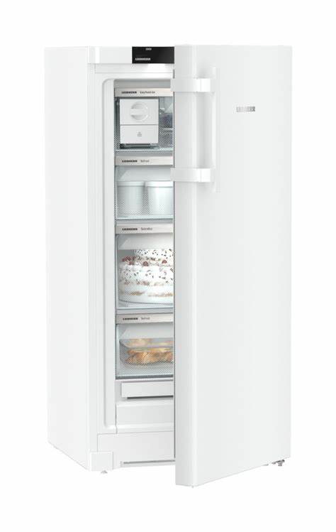
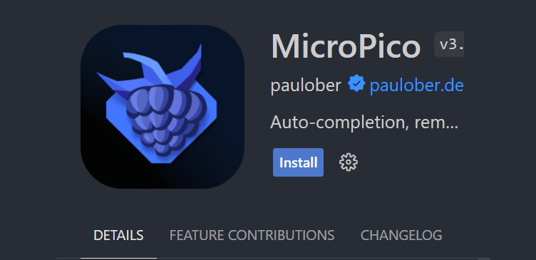
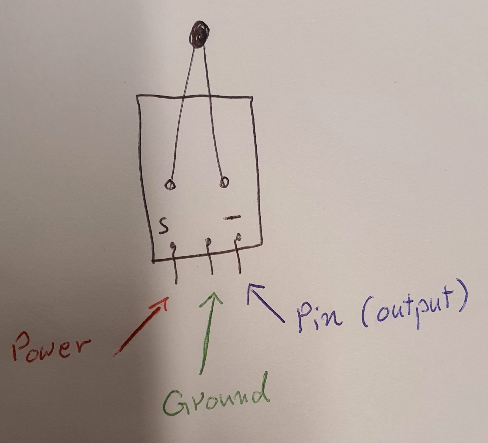
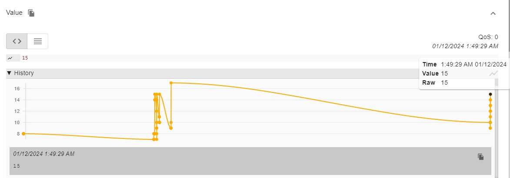
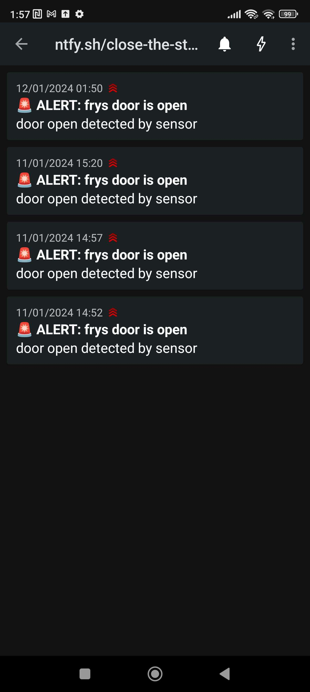

# Fridge Door Closer Detector
## Table of Contents

- [Introduction](#introduction)
- [Project Description](#project-description)
  - [Project Goal](#project-goal)
  - [Parts and Gear](#parts-and-gear)
  - [Development Environment](#development-environment)
- [Circuitry and Sensors](#circuitry-and-sensors)
  - [Reading the Analog Signal of NTC](#reading-the-analog-signal-of-ntc)
- [Code](#code)
  - [What the Code Does](#what-the-code-does)
- [Data Presentation](#data-presentation)
- [Results](#results)
- [Copyright Notice (Code)](#copyright-notice-code)


## Introduction

The 'Close the Stupid Door' project deals with the problem of people forgetting to close the refrigerator door, which leads to energy usage and potential food spoilage. This project uses technologies like analog and two DHT11 sensors connected to a microcontroller to offer a solution. It aims to notify users when the door is left open and allows for monitoring, ultimately improving energy efficiency, preserving food quality, and prolonging the lifespan of refrigerators. Overall, it contributes to creating a more sustainable lifestyle.

In addition, to these features i have the option to customize the device for uses. For instance it can be utilized to check the functioning of gas appliances. Moreover it has the capability to regulate the temperature and humidity levels within a house. Additionally i could incorporate a sensor that monitors whether lights are switched on in areas of the house. This adaptable device holds potential in providing assistance to individuals dealing with Alzheimers disease. With adjustments it can even serve as a life saving tool by preventing dangers, like fires. It would prove beneficial if implemented in retirement homes, where i could place transmitting devices in each room and receiving devices in staff areas.




## Project Description

### Project Goal

The goal of our IoT project is to address and solve the usual problem with open refrigerator doors, leading to unnecessary energy consumption and potential food loss. By implementing an intelligent and connected solution, i strive to offer users a reliable method to avoid and make aware of open refrigerator doors.

i strive to create a seamless integration betien a temperature sensor, placed on the refrigerator door, and a pico unit in another room, which acts as a central unit to monitor and check the status of the refrigerator. By using an MQTT server, i enable effective and rapid communication betien the sensor and the PICO device.

One of the primary goals is to minimize energy consumption by avoiding unnecessary cooling when the door is open. By sending temperature data from the sensor to the PICO device, i can quickly detect when the temperature inside the refrigerator begins to sink, indicating an open door. The Pico device will immediately act by activating red lights and an audio signal (buzzer) to warn the user.

i also strive to create a user -friendly and cost -effective solution. This includes easy installation and configuration, as ill as the ability to customize settings to suit the user's preferences and needs. By raising awareness of open refrigerator doors, our solution will not only help to reduce energy consumption but also minimize the risk of food loss and save time and money for the user.

Finally, with the goal of promoting sustainable habits and reducing negative environmental impact, our IoT solution will be part of a greater endeavor to smart and energy efficient homes. By integrating technology in a meaningful way into everyday life, i strive to create a positive impact on both individual level and society as a whole.

### Parts and Gear
| Part   | Description   | Price   |
|:----------:|:----------:|:----------:|
| raspberry pi pico 2040	|Microcontroller|$35 - $60  |
| Temperatursensor NTC	|Temperature Sensor|$3  |
| DHT11	|Measures the temperature and/or humidity|	$8 - $10  |
| Electronic Buzzer	| Audio signaling device|$10  |
| RC1602B-BIY-CSVD display	|LCD minitor |$5 - $7  |
| AA batterise	|poir|$3  |
| Micro USB cable |	Poir source	|Comes with most exp. boards  |
| Breadboard	| Heavily simplifies the wiring process|	$6  |
| Breadboard wire	|Poir transmission medium|	$4 (bundle)  |
|


### Development Environment 

#### installing vscode (windows)
This project uses Visual Studio Code. You can download it by pressing [Vscode]( https://code.visualstudio.com/download).

Make sure to download one of the latest version.

Here is my version of a step by step or you can follow the original guide from [geeksforgeeks](https://www.geeksforgeeks.org/how-to-install-visual-studio-code-on-windows/)
* **Step 1**: Visit the official ibsite  [Visual Studio Code]( https://code.visualstudio.com/download).


* **Step 2**: Press the **Download** button. **Important** be sure to select the download for your operating system; in our case, i use Windows.


* **Step 3**: After the download is complete, locate the downloaded file (usually in your Downloads folder) and run the installer.

* **Step 4**: Click on the the installer icon to start installing vscode
](img/vsSetup.png)

* **Step 5**: A application will popup and start asking for permission. 
](img/step5.png)
* **Step 6**: Choose the location for installation. **important** ensure that the option to add Visual Studio Code to the system PATH is selected. This is important for proper functionality.
](img/step6.png)


* **Step 7**: It will ask for installing just click next. 
](img/step7.png)
* **Step 8**: The installation will begin, and it may take a few minutes to complete.

* **Step 9**: Once the installation is finished, click on the **Finish** button.
](img/step9.png)

**Important: Install the MiroPico Extension for Vscode**

* **Step 1:** Open Visual Studio Code.
](img/vsc.png)
* **Step 2:** Click on the **Extensions** icon in the sidebar.
](img/extensions.png)
* **Step 3:** In the Extensions view, search for "MiroPico."
](img/searchex.png)
* **Step 4:** Click on the **Install** button next to the MicroPico extension.



# Circuitry and Sensors

In our project i are focusing on monitoring the temperature outside a refrigerator and comparing it to the temperature. To accomplish this i've included both an analog temperature sensor and two of DHT11 sensor, in the circuitry. The analog temperature sensor provides readings of the fridges temperature outside while the DHT11 sensor measures both temperature and humidity giving a complete picture of the fridges environment.


The goal of this project is to detect if the fridges internal temperature significantly differs from the temperature indicating that the door might be open. If this happens a warning or notification will be triggered to alert the user to close the door in order to maintain an temperature.


By combining these two sensors in our circuitry my aim is to create an efficient monitoring system that ensures functioning of the refrigerator and keeps its door closed when necessary.



git
### Reading the Analog Signal of NTC
#### DHT11 
Datasheet for [DHT11](https://www.mouser.com/datasheet/2/758/DHT11-Technical-Data-Sheet-Translated-Version-1143054.pdf)

Datasheet for [analog](https://www.ti.com/lit/ds/symlink/lm35.pdf) temperature sensor 


>The equation: combined_temperature=−15.0+( sensor_value_analog / 65535.0)×120.0

−15.0: This is a displacement value or offset. This means that even if the sensor data is 0, the temperature will be − 15.0 −15.0 in this system. Sensor_value_analog / 65535.0: Here you divide the sensor data by 65535.0, which is probably the maximum value the sensor can produce. This gives a normalized value betien 0 and 1.

× 120.0: The normalized sensor data is multiplied by 120.0. This is likely a scaling factor that converts the normalized value to a temperature betien 0.0 and 120.0.

So, to calculate the temperature, you insert the value of "sensor_value_analog" into the equation. For example, if you have a sensor data of 32767 32767, the calculation would look like this:

combined_temperature = − 15.0 + ( 32767 65535.0 ) × 120.0 

It is important to note that this equation is probably specific to the sensor or device you are using and its calibration. If possible, be sure to have the documentation for your sensor to understand exactly how the sensor data correlates with temperature.

>final_temperature= (temperature_DHT11+combined_temperature) / 2​
​

temperature_DHT11: This is the temperature value obtained from the DHT11 sensor.

combined_temperature: This is the result of the equation you provided earlier, which combines the analog sensor data into a temperature value.

This equation calculates the average temperature betien the reading from the DHT11 sensor and the combined temperature obtained from the analog sensor. By dividing the sum of these temperatures by 2, you get the average temperature value. This approach can be useful if you want to consider both sensor readings in determining the final temperature.

](img/dht11.png) *Picture taken from [arduinoeeletronica](https://arduinoeeletronica.com.br/produto/sensor-de-umidade-e-temperatura-dht11-2/)*


| DHT11 Pin | Pico Pin |
|-----------|------------|
| Vcc       | Pin        |
| GND       | Pin        |
| Data      | Pin        |


# Code
```
def dht_mesure(temperature):
        dh_sens.measure()
        temperature = dh_sens.temperature()

        print("Temperature: {}°C".format(temperature))

def read_and_convert_temperature(pin):
    sensor_value = machine.ADC(pin).read_u16()
    temperature2 = -15.0 + (sensor_value / 65535.0) * 120.0
    return temperature2 

def difference_betien_temp(differince, temperature, temperature2):
    differince = temperature - temperature2
    return differince
```
Here i get input about the current temperature from the sensor at the refrigerator door, and def to calculate through an equation if the temperature decreases.
#
```
async def messages(client):  # Respond to incoming messages
    global open 
    async for topic, msg, retained in client.queue:
        open = msg
        print((topic, msg, retained))
    
    
async def up(client):  # Respond to connectivity being (re)established
    while True:
        await client.up.wait()  # Wait on an Event
        client.up.clear()
        await client.subscribe('open', 1)  # renew subscriptions
```

The async def messages(client).The function is looking for message from the client. Then it store the incomming message in the global varible "open" the it print the message. 
#
```
async def main(client,differince):
    global open
    
    green_led.value(1)
    
    await client.connect()
    
    for coroutine in (up, messages):
        asyncio.create_task(coroutine(client))
    
    
    await client.publish('close', "0" , qos = 1)
    while True:
        await asyncio.sleep(0.25)
        if differince >== 5 ():
            green_led.value(0)
                     
            await client.publish('close', '1', qos = 1)
            
            
        while open == "1":
            green_led.value(1)
            await client.publish('close', "0", qos=1)
            
            open = None
        sleep(180)
```
In this piece of code , It happen that, Disabling the device depending on the variance, betien the sensor readings and verifying if the device is locked based on the value assigned to the lock variable.
#
```
def dht_mesure_humid():
        dh_sens.measure()
        humidity = dh_sens.humidity()
        return("Humidity: {}%".format(humidity))
        
def dht_mesure_temp():
        dh_sens.measure()
        temperature = dh_sens.temperature()
        return("Temperature: {}°C".format(temperature))
```
There are two definitions that allow you to print the values obtained from the humidity and temperature sensors.

```
def message_on_screen():
    lcd.clear()
    lcd.move_to(3,0)
    lcd.putstr("Close  The")
    lcd.move_to(2,1)
    lcd.putstr("Stupid Door")

def message_on_screen2():
    lcd.clear()
    lcd.move_to(3,0)
    lcd.putstr("Thank  You")

def message_on_screen3(humidity, temperature):
    lcd.clear()
    lcd.move_to(0,0)
    lcd.putstr("Humidity: {}%".format(humidity))
    lcd.move_to(0,1)
    lcd.putstr("Temperature: {}°C".format(temperature))
```
#

This definition talks about text that will be displayed on the screen. When the refrigerator door is open, the user will see a message on the screen:
<br>"Close the
<br>Stupid Door"

When the refrigerator door is closed, the user will see another message on the screen:
"    Thank you"
After a few seconds, the following will also be displayed:
<br>Humidity: {}%
<br>Temperature: {}°C

```
async def main(client):
    global close
    global has_started
    global has_started2
    await client.connect()
    for coroutine in (up, messages):
        asyncio.create_task(coroutine(client))
    await client.publish('open', "3", qos = 1)
    while True:
        await asyncio.sleep(0.25)

        if close == "1":
            if has_started2 == False:
                has_started2 = True
                red_led.value(1)
                message_on_screen(client)
                tick(10, 0.2)
                if buttonPin.value():
                    red_led.value(0)
                    message_on_screen2()
                    sleep(3)
                    await client.publish('open', "1", qos = 1)
                has_started = True
        if close == "0":
            if has_started == True:
                red_led.value(0)
                message_on_screen3(dht_mesure_humid(), dht_mesure_temp())
                await client.publish('open', "0", qos = 1)
                has_started = False
                has_started2 = False


 ```   
The program utilizes an asyncio event loop to manage the MQTT communication, in the background. It keeps track of the `value to determine the action, for opening or closing the door. This approach allows for performing tasks in an asynchronous manner.

# Data presentation

In my project, the use of Ntfy has proven to be of great importance in improving the user experience and raising awareness around open refrigerator doors. By integrating Ntfy into my Python code, I can send custom messages and alerts directly to the user when the sensor detects that the refrigerator door has been open too long.

Ntfy enables a fast and efficient notification mechanism, which is critical for informing the user in real time of potential problems. By receiving these messages, the user can immediately take action to close the refrigerator door and avoid energy waste or loss of refrigerated goods.

The customizable nature of Ntfy also gives me the flexibility to tailor the messages depending on specific events or conditions, increasing the precision and usability of the project. Overall, Ntfy plays a central role in making my IoT project more interactive and user-centric by providing quick and clear notifications when needed.

](img/image.png)

The image shows a graph with an X-axis and a Y-axis. The x-axis represents time, with timestamps appearing at various points. The y-axis represents a temperature difference, which is the difference betien the temperature at the freezer door and room temperature.

The graph has a line that shows variations in the temperature difference over time. There are marked data points along the line, indicating that measurements ire taken at specific times. At certain times i see spikes or large changes in the temperature difference, which may indicate rapid changes in one of the two measured temperatures.

The quality of service (QoS) is indicated as 0 in the upper right corner, which can be an indicator of the reliability of the measurement or some kind of quality of service rating.

](img/Screenshot_2024-01-14-13-31-44-939_io.heckel.ntfy.jpg)

# Results

The statement "Close the stupid door?" served as the starting point, for our project. After finishing it our house has gone through a transformation becoming both smarter and safer. This was made possible by incorporating two microcontrollers and sensors. The project involved using two microcontrollers, batteries, bulbs with wires and two specialized devices.

The first device is strategically positioned near the refrigerator door to monitor room and refrigerator temperatures. If any sudden changes are detected it immediately sends an alert to the device using MQTT technology. When the user receives this alert they can press a button to turn off a light as confirmation. A message of appreciation follows along with a report on room temperature and humidity.

Completing this project successfully is crucial as it addresses concerns such as preventing damage to the refrigerator reducing electricity waste and making sure our food doesn't go to waste. Looking ahead i have plans to share this technology globally by considering providing the design for the device to countries at an affordable price due to its significant impact, on daily life.

This video showing and clarifying our project:
<video src="img/lv_0_20240114142034.mp4" controls title="Title"></video>

### This is the end product of our project.
<video src="img/endproduct.mp4" controls title="Title"></video>

## Copyright Notice (Code)
Copyright Notice (Code)
Copyright © 2025 Osama Rashdan

Permission is hereby granted, free of charge, to any person obtaining a copy of this software and associated documentation files (the “Software”), to deal in the Software without restriction, including without limitation the rights to use, copy, modify, merge, publish, distribute, sublicense, and/or sell copies of the Software, and to permit persons to whom the Software is furnished to do so, subject to the following conditions:

The above copyright notice and this permission notice shall be included in all copies or substantial portions of the Software. Any materials derived from this Software must be accompanied by a reference to the author (Osama Rashdan).

THE SOFTWARE IS PROVIDED “AS IS”, WITHOUT WARRANTY OF ANY KIND, EXPRESS OR IMPLIED, INCLUDING BUT NOT LIMITED TO THE WARRANTIES OF MERCHANTABILITY, FITNESS FOR A PARTICULAR PURPOSE, AND NONINFRINGEMENT. IN NO EVENT SHALL THE AUTHORS OR COPYRIGHT HOLDERS BE LIABLE FOR ANY CLAIM, DAMAGES, OR OTHER LIABILITY, WHETHER IN AN ACTION OF CONTRACT, TORT, OR OTHERWISE, ARISING FROM, OUT OF, OR IN CONNECTION WITH THE SOFTWARE OR THE USE OR OTHER DEALINGS IN THE SOFTWARE.

Author: Osama Rashdan
Code Links:
- Kitchen script: [Link to Kitchen script](https://gitlab.lnu.se/1dt901/student/cidmv-7/close-the-stupide-door/-/blob/main/kitchen_.py?ref_type=heads)
- Living Room script: [Link to Living Room script](https://gitlab.lnu.se/1dt901/student/cidmv-7/close-the-stupide-door/-/blob/main/living_room.py?ref_type=heads)


