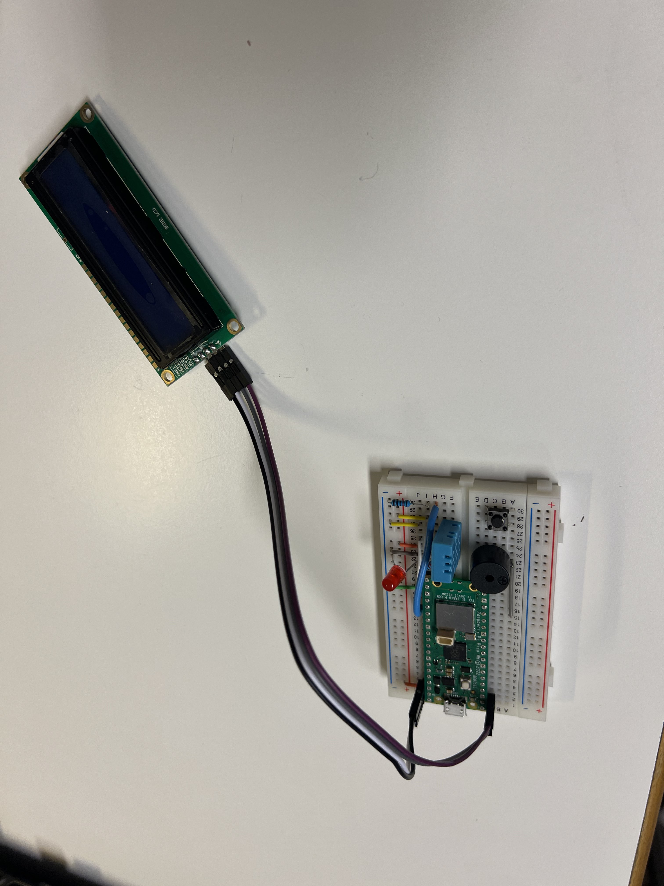
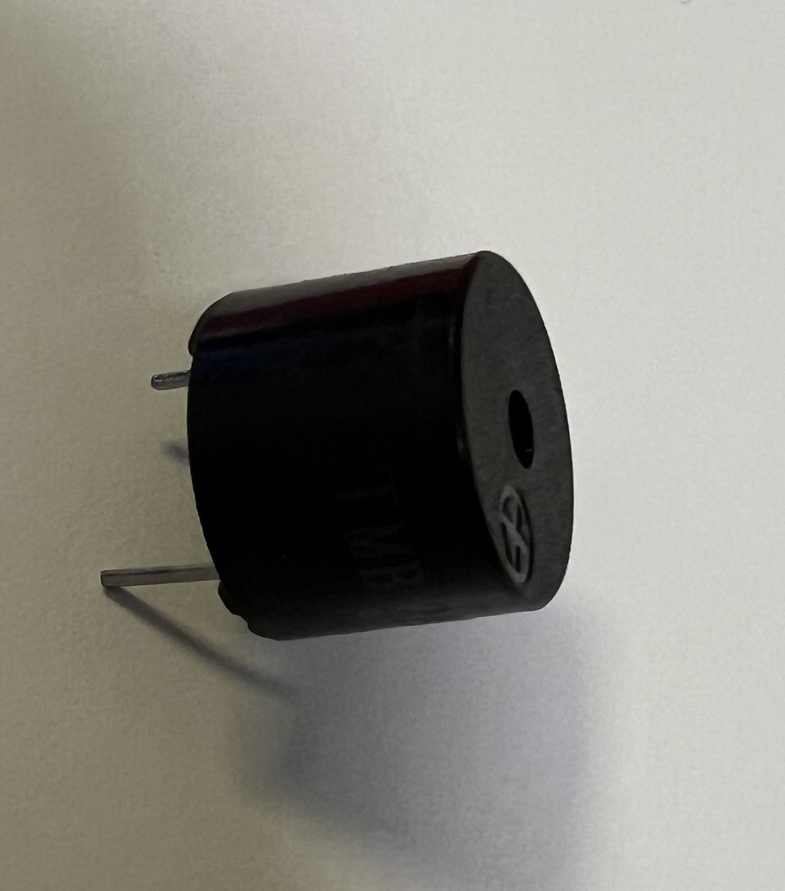
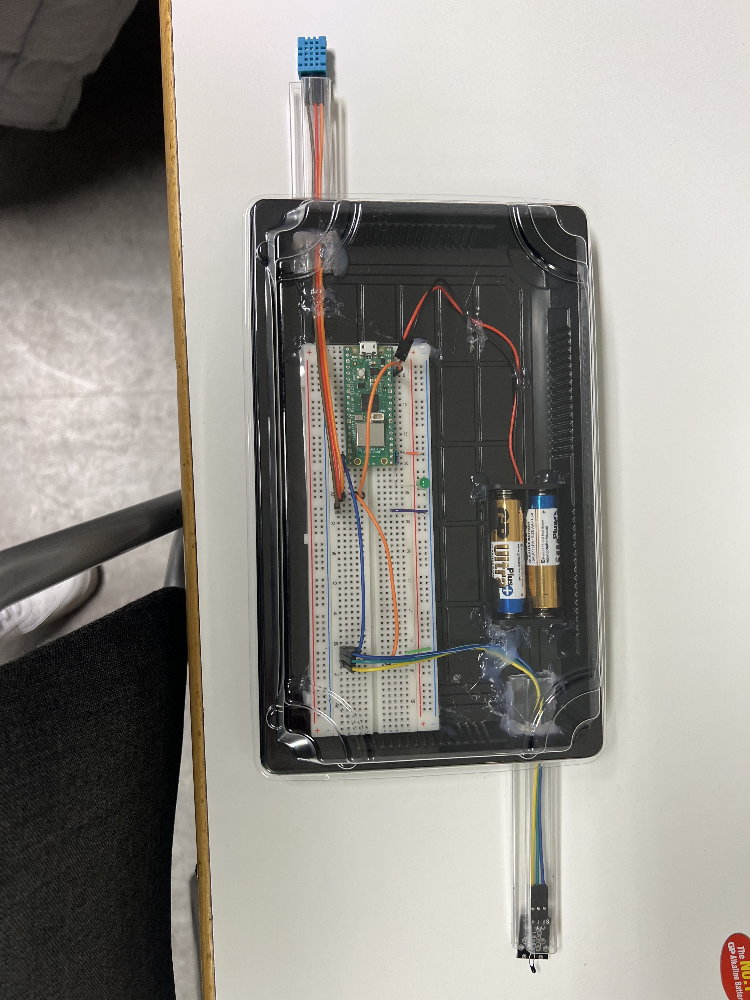

# Hardware Description

## Raspberry Pico W

- [MicroPython](https://www.raspberrypi.com/documentation/microcontrollers/raspberry-pi-pico.html)
- [MicroPython UF2](https://www.raspberrypi.com/documentation/microcontrollers/raspberry-pi-pico.html)

### Living Room Setup

#### Screen Setup

- Power: Pin 40 on Raspberry Pico
- Ground: Pin 38 on Raspberry Pico
- SDA (Serial Data): Pin 1 on Raspberry Pico
- SCL (Serial Clock): Pin 2 on Raspberry Pico

#### DH11 Sensor Setup

- Pin 1 (GPIO): Any GPIO pin on Raspberry Pico
- Pin 2 (Data): Connect as needed
- Pin 3 (Power): Raspberry Pico Power
- Pin 4 (Ground): Raspberry Pico Ground

#### Buzzer Setup

#### Button Setup

#### Red LED Setup

- Short Pin: Raspberry Pico Ground
- Long Pin: GPIO Pin on Raspberry Pico

#### Living Room Prototype

### Kitchen Setup

#### Analog and DHT11 Setup

- Signal Pin to GPIO: GPIO 14 on Raspberry Pico
- Ground for Signal Pin: Connect to DHT11 Pin 1
- 3V3 Power Supply: Connect to DHT11 Pin 1
- DHT11 Data to GPIO: GPIO 15 on Raspberry Pico
- DHT11 Ground to Raspberry Pi Pico Ground: Pin 23 on Raspberry Pico
- Analog Ground: Pin 3 on the lower part of the circuit board

#### Kitchen Prototype

