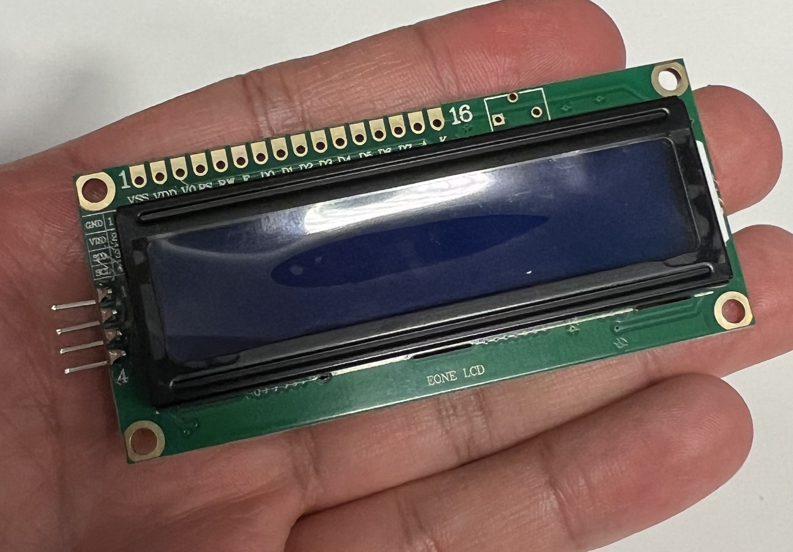
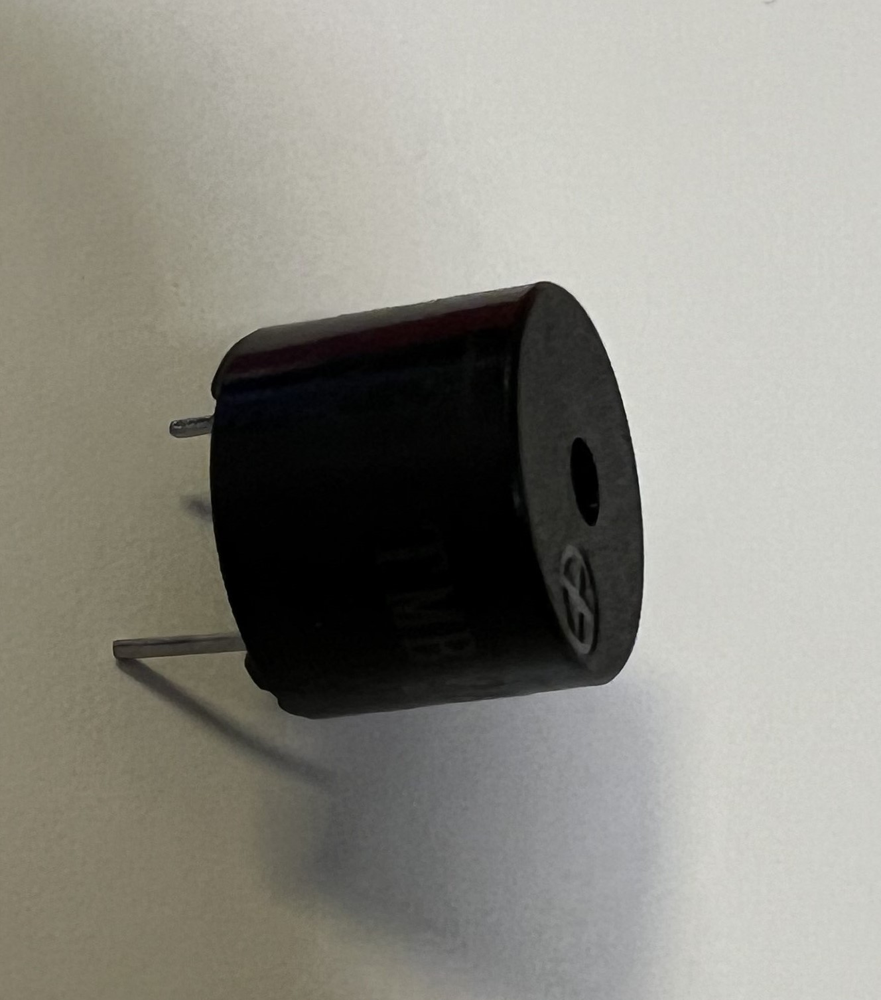
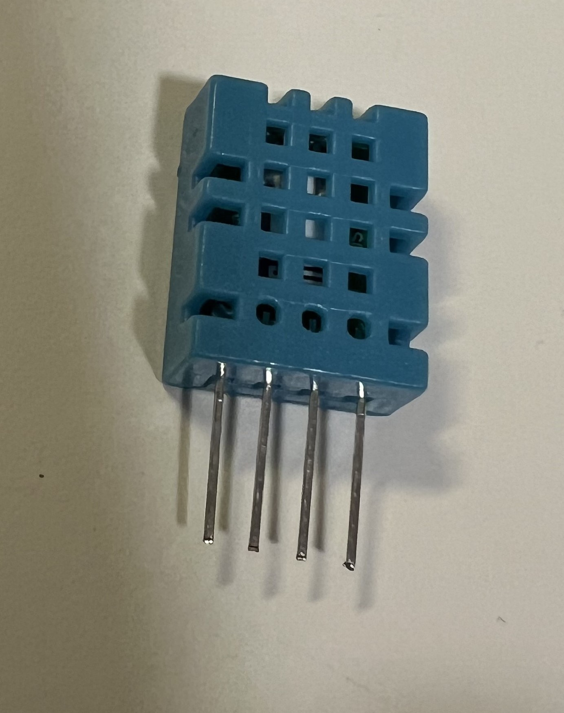
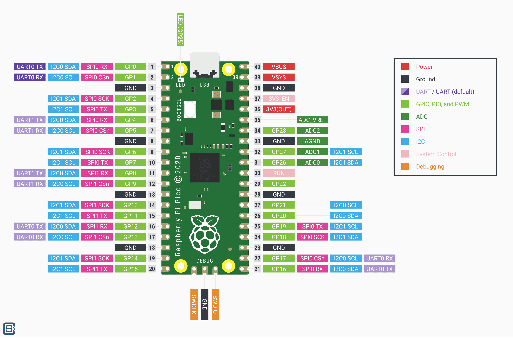
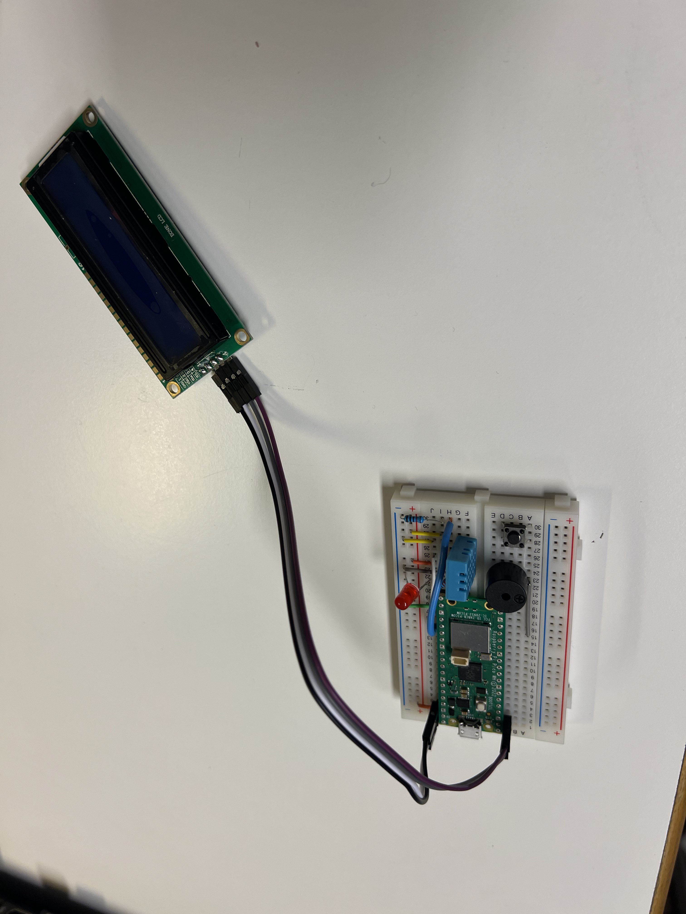
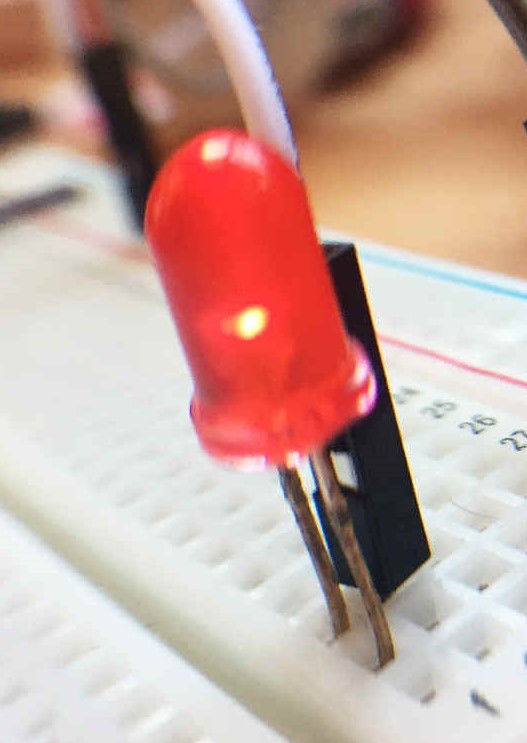
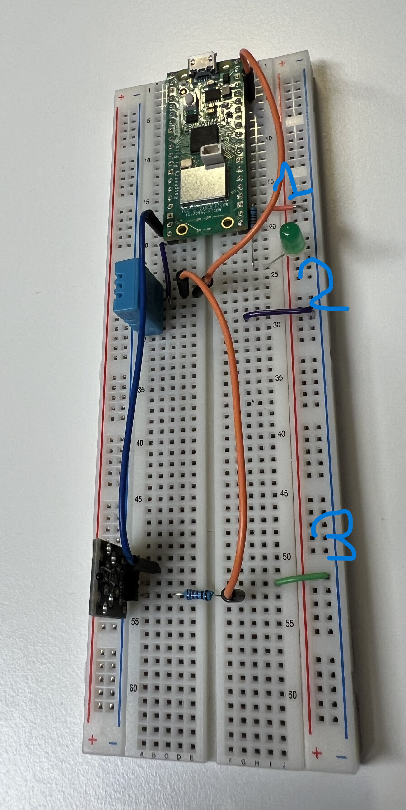
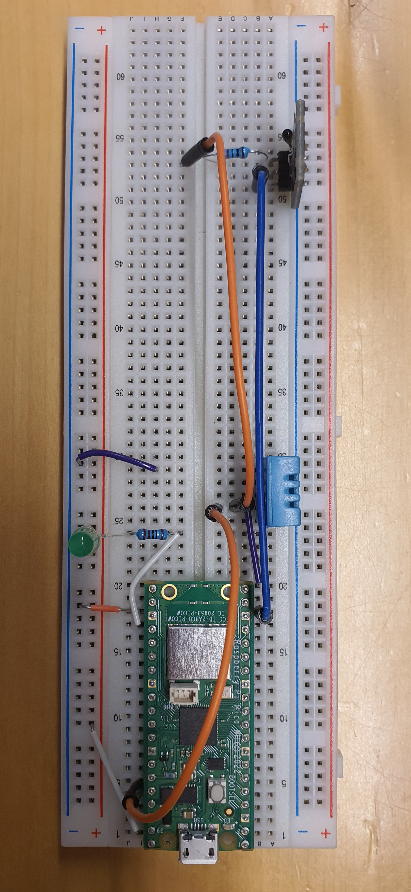
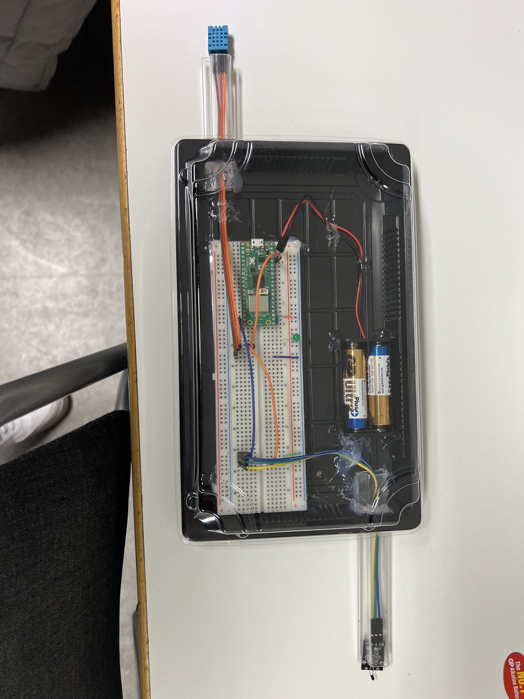

# Raspberry Pico W

If this is your first time using Raspberry Pico W, you need to follow these steps:

1. Download the [MicroPython](https://www.raspberrypi.com/documentation/microcontrollers/raspberry-pi-pico.html) from the official documentation.
1. Download the [MicroPython UF2](https://www.raspberrypi.com/documentation/microcontrollers/raspberry-pi-pico.html) from the official documentation.

2. Verify USB Connection
Ensure that your Raspberry Pico is connected to your computer via USB, and the connection is stable.
3. Downlaoding UF2 file
Flash the downloaded UF2 file to your Pico. This ensures that your Pico has the latest version of MicroPython.

## Raspberry Pi Pico W Datasheet

https://www.raspberrypi.com/documentation/microcontrollers/raspberry-pi-pico.html

# Living room setup

## Screen setup 
To connect the screen with four pins to the Raspberry Pi Pico, where the screen has a power pin `Power` connected to Pin number 40 and a ground pin `Ground` connected to Pin number 38 on Raspberry Pi Pico, you also need to connect the last two pins to `SDA` (Serial Data) and `SCL` (Serial Clock) for I2C communication.

Here is a quick guide:

- Power: Connect the screen's power to pin nummber 40 on the Raspberry Pico.

- Ground: Connect the screen's ground to pin number 38 on the Raspberry Pico.

- SDA (Serial Data): To enable I2C communication, connect the display's SDA to the pin nummber 1 which is corresponding SDA pin on the Raspberry Pico.

- SCL (Serial Clock): Connect the screen's SCL to the pin nummber 2 which is corresponding SCL pin on the Raspberry Pico.

By following this wiring guide you should be able to use the display with the Raspberry Pico via I2C communication.

## DH11 sensor setup
The temperature sensor comes with four pins, but ionly need three of them: one for GPIO pin, one for power and one for ground. To know which pin on the Raspberry Pi Pico to connect to which pin on the sensor, hold the sensor with the perforated side facing you. The furthest stick to the left is number 1, next to it is number 2, and so on. So, the farthest pin to the left number 1 is the GPIO pin, the farthest pin to the right (number 4) is Ground, and the one that is number 3 is Power. Number 2 is the data pin that transfers information from the sensor, for example to an analog sensor, and idon't need that in the living room setup.

Here is a quick guide:

- Pin 1 (GPIO): Connect to any GPIO pin on the Raspberry Pi Pico.
- Pin 2 (Data): Connect to the appropriate data input, e.g. to an analog sensor.
- Pin 3 (Power): Connect to the power pin of the Raspberry Pi Pico.
- Pin 4 (Ground): Connect to the ground pin of the Raspberry Pi Pico.

NOTE: Make sure the connections are correct and securely connected or the sensor will burn.

 https://arduinoeeletronica.com.br/produto/sensor-de-umidade-e-temperatura-dht11-2/

## Buzzer setup
The buzzer has two pins, one long and one short, the long one should be connected to a GPIO pin and the short one to a Ground in the raspberry pi pico.

## Button setup
You can choose either side A or side B and you can choose which pin of the two pins in the selected side, but it must be one for Power and one for Ground in the raspberry pi pico.

## Red led
The is lead also has two pins, one long and one short, the short one to Ground and the long one to a GPIO pin.

https://www.robertprice.co.uk/robblog/controlling-a-led-on-a-raspberry-pi-with-php/

### The last connections to the living room, ihave put them in our own creative prototype and it look like this:

# Kitchen setup
## Analog and DHT11 setup
- Signal pin (Analog) to GPIO: Connect the signal pin (often labeled 'Analog' on some sensors) to GPIO pin number 14 on the Raspberry Pi Pico.
- Ground for Signal pin: Connect the Ground (GND) of the signal pin to the same row as pin number 1 of the DHT11 sensor.
- 3V3 Power Supply: Connect another wire from the same row as pin number 1 on the DHT11 to 3V3 pin (number 36) on the Raspberry Pi Pico to supply power to the DHT11 sensor.
- DHT11 Data to GPIO: Connect pin number 2 of the DHT11 sensor to GPIO pin number 15 of the Raspberry Pi Pico. This is the data connection for the sensor.
- DHT11 Ground to Raspberry Pi Pico Ground: Connect pin number 4 of the DHT11 sensor to Ground pin number 23 of the Raspberry Pi Pico. In the picture you have uploaded, this corresponds to pin number 1 and 2 in the lower part of the circuit board.
- Analog Ground: Connect the Ground of the analog signal to pin number 3 in the lower part of the circuit board, as shown in the picture below.

Remember to always double check each connection before applying power to your circuit to prevent damage to the components.
 https://www.pinterest.co.uk/pin/ky035-module-pinout--467600373819376771/

 
## clearer picture of all connections to the breadboard

### The last connections to the kitchen room, ihave put them in our own creative prototype and it look like this:

