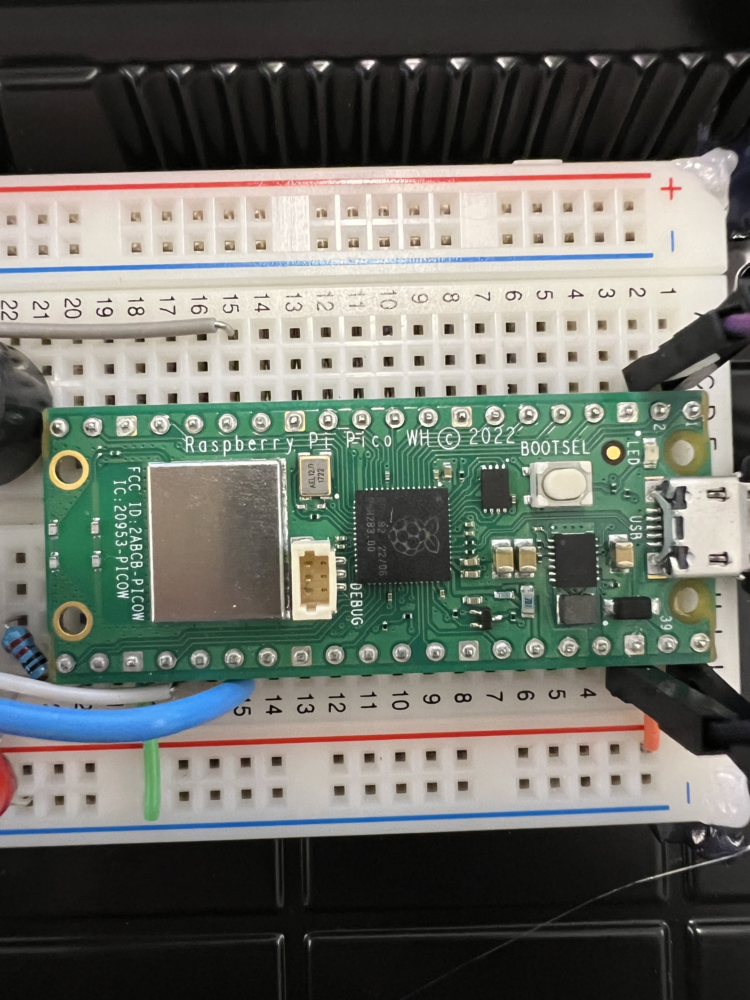

# Raspberry Pico W

## Test Pico:
After flashing MicroPython, you run this code, it with blink on/off the LED on the mainboard. 

```
import machine
import utime

# Mainbord LED pin
led_pin = machine.Pin(25, machine.Pin.OUT)

# blink-led
def blink_led():
    while True:
        led.value(1) # On
        time.sleep(1) # Sleep for 1 second
        led.value(0) # Off
        time.sleep(1) # Sleep for 1 second

# Run the blink function
blink_led()

```
The LED-screen have 2 pin to connect to pico and the 3rd for GND. The two input pin controll the upper half off the screen and bottom. 

## Testing the Screen 
Make sure you have follow the guide how to connect it in the setup.

```

```

todo: add pic


'


# Buzzer

```
import machine
import utime

# Buzzer pin make your to change it to your pin
buzzer_pin = machine.Pin(15, machine.Pin.OUT)

# Beeping buzzer
def beep(duration_ms=500):
    buzzer_pin.on()
    utime.sleep_ms(duration_ms)
    buzzer_pin.off()

# Main
while True:
    beep()  # Call the beep function
    utime.sleep(1)  # Wait for 1 second between beeps
```
- If your buzzer isn't producing any sound, check the breadboard circuit. Ensure you have connected the buzzer correctly; it might be inserted the wrong way. Verify the polarity, with the longer leg or '+' marking as the positive terminal. Confirm your wiring and double-check the GPIO pin configuration on your Raspberry Pi Pico.


# DHT11

```
import machine
import dht
import utime

# DHT11 pin
dht_pin = machine.Pin(15)

# Create a DHT object
dht_sensor = dht.DHT11(dht_pin)

# Function for temperature and humidity
def read_dht_data():
    dht_sensor.measure()
    temperature_celsius = dht_sensor.temperature()
    humidity_percentage = dht_sensor.humidity()
    print("Temperature: {}°C, Humidity: {}%".format(temperature_celsius, humidity_percentage))

# Main loop
while True:
    read_dht_data()
    utime.sleep(2)  # Wait for 2 seconds then the sensor read again

```
- If your DHT11 sensor is not providing any data, try checking the wiring on your breadboard. Make sure it has correct polarity with the sensor's arrow or '+' marking indicating the positive side. Checking the sensor is connected to the right pins.

# Todo pic NTC

```
import machine
import utime

# NTC pin
ntc_pin = machine.ADC(26)

# Function to read and print the resistance
def read_ntc_resistance():
    ntc_value = ntc_pin.read_u16()
    ntc_resistance = (65535 / ntc_value) - 1
    ntc_resistance = 10000 / ntc_resistance  # 10K ohm resistance
    print(f"NTC Resistance: {ntc_resistance:.2f} ohms")

# Main
while True:
    read_ntc_resistance()
    utime.sleep(2)  # Wait for 2 seconds before taking the next reading

```
- If your NTC sensor isn't providing any data, inspect the breadboard circuit. Make sure it has correct polarity. Check the wiring and double-check the ADC pin.

# Screen
## Setting up the LCD Screen

# Install the [I2cLcd](https://github.com/T-622/RPI-PICO-I2C-LCD) library on your Raspberry Pi Pico.
```
# Import necessary modules
from machine import Pin, I2C
from i2c_lcd import I2cLcd
import utime

# I2C configuration
I2C_ADDR = 0x27  # I2C address of the LCD display (adjust based on your display's configuration)
I2C_NUM_ROWS = 2  # Number of rows on the LCD display
I2C_NUM_COLS = 16  # Number of columns on the LCD display

# Create an I2C object
i2c = I2C(0, sda=Pin(0), scl=Pin(1), freq=400000)  # Make sure the pins match your Pico device.

# Create an I2cLcd object
lcd = I2cLcd(i2c, I2C_ADDR, I2C_NUM_ROWS, I2C_NUM_COLS)

# Clear the display
lcd.clear()

# Display some text using f-strings
lcd.putstr(f"LCD Test\nHello, World!")

# Main loop
while True:
    # Scroll the text using f-strings
    lcd.move_to(0, 1)
    lcd.putstr(f"Time: {utime.localtime()}")
    utime.sleep(1)


```

# MQTT
## seting up mqtt
### Micropython MQTT Library
Download the mqtt.py module from the micropython-mqtt

```
import machine
import utime
from mqtt import MQTTClient

# WiFi and MQTT broker details
WIFI_SSID = "YourWiFiSSID"
WIFI_PASSWORD = "YourWiFiPassword"
MQTT_BROKER = "mqtt.eclipse.org"
MQTT_PORT = 1883
MQTT_CLIENT_ID = "pico_client"

# MQTT topics
SUBSCRIBE_TOPIC = "pico/subscribe"
PUBLISH_TOPIC = "pico/publish"

# Callback function for incoming messages
def mqtt_callback(topic, msg):
    print("Received message on topic: {}, Message: {}".format(topic, msg))

# Connect to WiFi
def connect_wifi():
    import network
    wlan = network.WLAN(network.STA_IF)
    wlan.active(True)
    if not wlan.isconnected():
        print("Connecting to WiFi...")
        wlan.connect(WIFI_SSID, WIFI_PASSWORD)
        while not wlan.isconnected():
            pass
        print("Connected to WiFi")

# Main MQTT function
def mqtt_main():
    connect_wifi()

    client = MQTTClient(MQTT_CLIENT_ID, MQTT_BROKER, port=MQTT_PORT)
    client.set_callback(mqtt_callback)

    print("Connecting to MQTT broker...")
    client.connect()
    print("Connected to MQTT broker")

    # Subscribe to a topic
    client.subscribe(SUBSCRIBE_TOPIC)
    print("Subscribed to topic: {}".format(SUBSCRIBE_TOPIC))

    try:
        while True:
            # Publish to a topic
            message = "Hello from Raspberry Pi Pico!"
            client.publish(PUBLISH_TOPIC, message)
            print("Published message on topic: {}, Message: {}".format(PUBLISH_TOPIC, message))

            # Check for incoming messages
            client.check_msg()

            utime.sleep(5)

    finally:
        client.disconnect()
        print("Disconnected from MQTT broker")

# Run the main MQTT function
mqtt_main()

```
Update the WIFI_SSID and WIFI_PASSWORD variables with your WiFi credentials.
Modify the MQTT_BROKER variable with the address of your MQTT broker.
- Change the WIFI_SSID and WIFI_PASSWORD
to your wifi, you can also Mobile Hotspot

- Make sure it's in the same directory as your main script


# NTFY
## Make an account on [NTFY](https://ntfy.sh/) - the free version.
## After making an account, copy your URL to request.

## Test code
```
import urequests as requests
from time import sleep

while True:
    try:
        # Send a POST request to the ntfy.sh service
        response = requests.post(
            "https://ntfy.sh/close-the-stupied-door",
            data="door open detected by sensor",
            headers={"Content-Type": "application/json"},  # Specify content type if necessary
        )

        # Check the status code of the response
        if response.status_code == 200:
            print("Notification sent successfully")
        else:
            print(f"Failed to send notification. Status code: {response.status_code}")

    except Exception as e:
        # Handle exceptions that might occur during the HTTP request
        print(f"Error: {e}")

    # Sleep for 10 seconds before sending the next notification
    sleep(10)
```